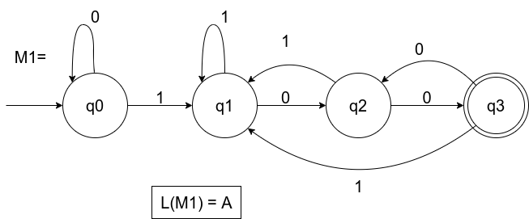

= Language Theory
:stem: latexmath

== Regular Languages

A language is called a **regular language** if some finite automaton recognizes it or it is
described by a regular expression.

=== Finite Automaton

A _finite state machine (**FSM**)_ or _finite automaton_ is the simplest **computational model**, 
used to represent computers with limited amount of memory (few states).

A finite automaton is a **5-tuple** (stem:[Q, \Sigma, \delta, q0, F]), where:

. stem:[Q] is the finite set of **states**
. stem:[\Sigma] is the **alphabet**, a finite set of allowed input symbols
. stem:[\delta: Q \times \Sigma \rightarrow Q] is the **transition function** 
. stem:[q0 \in Q] is the **start state**
. stem:[F \subseteq Q] is the **set of accept/final states**

A machine [.underline]#may accept several strings#, but it [.underline]#always recognizes one language#. +
stem:[M] recognizes stem:[A], if stem:[A] is the set of all strings that machine stem:[M] accepts.
Therefore stem:[A] is the language of machine stem:[M], stem:[L(M) = A]

==== Example
[stem]
++++
\text{Let}\ A = \lbrace w \mid w \text{ contains at least one 1 and an even number of 0s 
follow the last 1}\ \rbrace
++++

Alphabet stem:[\Sigma = \{0, 1\}]

All states stem:[Q = \{q0, q1, q2, q3\}]

* no 1 found = stem:[q0]
* 1 found but no trailing 0s = stem:[q1]
* 1 found, odd trailing 0s = stem:[q2]
* 1 found, even trailing 0s = stem:[q3]

Final states stem:[F = \{q3\}]

.Transition function as state transition table
[cols="1,1,1"]
[%autowidth]
|===
|stem:[Q \backslash \Sigma]|0|1

|q0|q0|q1

|q1|q2|q1

|q2|q3|q1

|q3|q2|q1
|===

.State diagram

=== Formal Computation

Let stem:[M = (Q, \Sigma, \delta, q0, F)] be a finite automaton. +
Let stem:[w = w_1 w_2 ... w_n] be a string where each stem:[w_i] is a member of the 
alphabet stem:[\Sigma].

stem:[M] accepts stem:[w] if a sequence of states stem:[r_0,r_1,...,r_n] exists in stem:[Q] 
with three conditions:

. stem:[r0 = q0]
. stem:[\delta(r_i, w_{i+1}) = r_{i+1}] for stem:[i = 0,1,...,n-1]
. stem:[r_n \in F]

=== Regular Operations

Let stem:[A] and stem:[B] be languages

* **Union**: stem:[A \cup B = \{x \mid x \in A \text{ or } x \in B\}]
* **Concatenation**: stem:[A \circ B = \{xy \mid x \in A \text{ and } y \in B\}]
* **Star**: stem:[A^* = \{x_1x_2...x_n \mid n >=0 \text{ and each } x_n \in A\}]

.Note

* The collection of regular languages [.underline]#is closed under all three operations# (Theorem)
* stem:[\epsilon \in A^*] 

=== Nondeterminism

Nondeterminism is a generalization of determinism, every deterministic finite automaton is 
automatically a nondeterministic finite automaton. +
In a **nondeterministic** machine several choices may exist for the next state at any point, 
as opposed to deterministic machines where the next state is always known for any given state 
and input symbol.

A _nondeterministic finite automaton (**DFA**)_ is a **5-tuple** (stem:[Q, \Sigma, \delta, q0, F]), 
where:

. stem:[Q] is the finite set of **states**
. stem:[\Sigma] is the **alphabet**, a finite set of allowed input symbols
. stem:[\delta: Q \times \Sigma_{\epsilon} \rightarrow P(Q)] is the **transition function** 
. stem:[q0 \in Q] is the **start state**
. stem:[F \subseteq Q] is the **set of accept/final states**

.**NFA** characteristics

* arrows may be labeled with stem:[\epsilon]. When an NFA reaches a state with an exiting arrow
labeled stem:[\epsilon], the machine splits without reading any input and an execution branch follows 
the stem:[\epsilon]-labeled arrow
* any state may have 0,1 or more exiting arrow for each alphabet (stem:[\Sigma_{\epsilon}]) symbol
* any NFA can be converted in an equivalent DFA (Theorem)

=== Regular Expressions

A _regular expression_ describes a regular language through a combination of regular operations.
It has the same expressiveness of a _regular grammar_.

[stem]
++++
(0 \cup 1) = L = \{0, 1\}\\
++++

**Note**: if stem:[\Sigma] is any alphabet, the regular expressioni stem:[\Sigma] describes 
the language consisting of all strings of lenght 1 over this alphabet, and stem:[\Sigma^*]
describes the language of all strings over that alphabet.

.Regular operations precedence:

. star
. concatenation
. union

.stem:[R] is a regular expression, if stem:[R] is:

* stem:[a] for some stem:[a] in the alphabet stem:[\Sigma]
* stem:[\epsilon]
* stem:[\emptyset]
* (stem:[R_1 \cup R_2]), where stem:[R_1] and stem:[R_2] are regular expressions
* (stem:[R_1 \circ R_2]), where stem:[R_1] and stem:[R_2] are regular expressions
* (stem:[R_1^*]), where stem:[R_1] is a regular expression

.Identities:

* stem:[R \cup \emptyset = R]
* stem:[R \circ \epsilon = R]
* Any regular expression can be converted in an equivalent FSM 

==== Generalized Nondeterministic Finite Automaton

A _generalized nondeterministic finite automaton (**GDFA**)_ is an NFA wherein the transition arrows
may have regular expressions as labels, instead of only members of the alphabet or stem:[\epsilon]. +
The GFNA [.underline]#reads blocks of symbols# from the input.

.Construction convention

* start state has arrows going to any other state but no arrows coming in
* only 1 accept state, it has arrows coming in from any other state but not going out
* any state has arrows coming in from any other state and itself, as well as arrows going out
to any other state (only for non-start, non-accepting states).

...TODO

